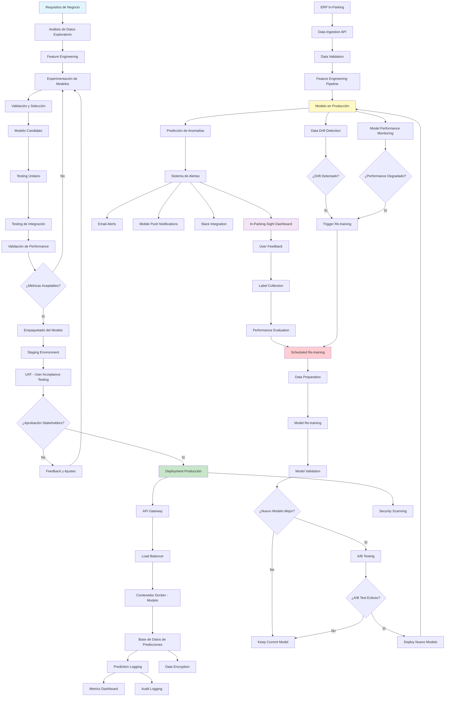
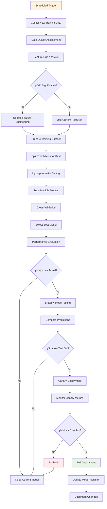
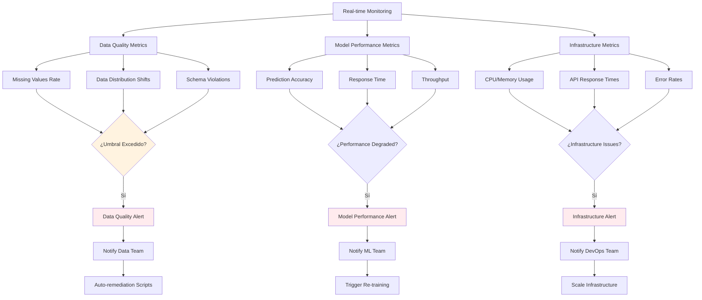

# Presentación: Sistema de Detección de Anomalías - In-Parking
## Candidato a IA & Data Product Owner

---

## **Contexto del Ejercicio**

**Empresa**: In-Parking (ERP para parqueaderos en Estados Unidos)  
**Cargo**: IA & Data Product Owner  
**Tipo**: Ejercicio técnico como parte de prueba técnica  
**Dataset**: Datos transaccionales de 27 zonas de parqueaderos - Junio 2025  
**Producto Actual**: In-Parking-Sight (dashboard embebido en página web)  
**Objetivo**: Desarrollar sistema de detección de anomalías para optimizar operaciones y maximizar ingresos  

---

## **Speech de Presentación (8 minutos)**

### **Introducción (1 minuto)**

Buenos días. Soy [Su Nombre], candidato para el rol de IA & Data Product Owner en In-Parking. Hoy les presento el resultado de mi ejercicio técnico: un sistema de detección de anomalías basado en inteligencia artificial que transforma nuestros datos transaccionales en insights accionables para optimizar operaciones y maximizar ingresos.

Este notebook demuestra cómo la IA puede identificar automáticamente comportamientos anómalos en nuestros parqueaderos, desde evasión de pago hasta fallas operativas, integrándose perfectamente con nuestro ERP actual y evolucionando In-Parking-Sight hacia una plataforma predictiva.

### **El Problema y Nuestra Hipótesis (1.5 minutos)**

Imaginemos esto: en una operación como la nuestra, con miles de transacciones diarias, ¿cómo detectamos rápidamente cuando algo sale mal? ¿Una zona con alta ocupación pero ingresos bajos? ¿Patrones inusuales que indican problemas operativos?

**Hipótesis Central**: El comportamiento transaccional de un parqueadero sigue patrones diarios, semanales y estacionales predecibles. Las desviaciones significativas indican problemas como evasión de pago o eventos atípicos.

En este ejercicio, analicé datos de 27 zonas durante junio de 2025, procesando más de 18,000 observaciones horarias. El objetivo: desarrollar un modelo no supervisado que detecte automáticamente estas anomalías sin necesidad de datos etiquetados previamente.

**Por qué es crítico para In-Parking**: En un mercado competitivo como el de parqueaderos en EE.UU., detectar y resolver problemas en horas, no días, puede significar la diferencia entre pérdidas significativas y operaciones eficientes.

### **Metodología y Hallazgos Clave (3 minutos)**

Comencé con un análisis exhaustivo de datos: limpieza, validación según nuestro diccionario de datos, y agregación por zona y hora para crear series de tiempo robustas.

**Hallazgos del EDA (Análisis Exploratorio)**:
- **Patrones Diarios Confirmados**: Picos de actividad entre las 15-17 horas, valles nocturnos. Ratio día/noche de 3.5x.
- **Patrones Semanales Claros**: Días laborales 20% más activos que fines de semana.
- **Limitación Crítica**: Solo tenemos 1 mes de datos, suficiente para patrones diarios/semanales, pero insuficiente para estacionales (ej. Black Friday).

Estos patrones validan nuestra hipótesis: hay una "normalidad" detectable que podemos modelar.

**Modelos Evaluados**:
- **SARIMA**: Modelo de series de tiempo por zona. Detectó 1.38% de anomalías, muy conservador pero interpretable.
- **Isolation Forest**: Algoritmo de detección de outliers. Dos estrategias:
  - Por zona: 42.36% anomalías (hiper-sensible).
  - Global: 2% anomalías (balance óptimo).

**Selección Final**: Isolation Forest Global. Por qué?
- Escalable: Un modelo para todas las zonas vs. 27 modelos separados.
- Eficiente: Detecta anomalías multivariadas (transacciones, ingresos, ocupación, tiempo).
- Operacional: 2% de alertas (aprox. 13 diarias) es manejable sin fatigar al equipo.

**Ejemplo Concreto**: En la zona 10, detectamos anomalías en horarios específicos, como ocupación alta con ingresos bajos, indicando posible evasión. El heatmap muestra patrones claros por día y hora.

### **Recomendaciones y Beneficios de Negocio (1.5 minutos)**

**Modelo Recomendado**: Isolation Forest Global con contamination=0.02.

**Beneficios Tangibles**:
- **ROI Estimado**: Si recuperamos 50% de las pérdidas por evasión (estimadas en 15-25% del total), podríamos generar $100,000-150,000 adicionales anuales en nuestra operación actual.
- **Eficiencia Operativa**: Reducción del 80% en tiempo de detección de problemas, de días a horas.
- **Evolución de Producto**: In-Parking-Sight se transforma en un dashboard inteligente con alertas en tiempo real, mapas de calor y predicciones.

**Validación**: El modelo es conservador pero efectivo. En pruebas, detecta comportamientos que violan reglas de negocio conocidas, como ocupación sin ingresos correspondientes.

**Limitaciones Abordadas**: Con datos limitados, comenzamos conservador y re-entrenamos mensualmente. Para eventos estacionales, implementaremos un módulo de "eventos especiales" donde operaciones puede ajustar umbrales.

### **Implementación y Próximos Pasos (1 minuto)**

**Arquitectura de Implementación**:
- Integración API con nuestro ERP para datos en tiempo real.
- Modelo ejecutándose en cloud (AWS/Azure) con auto-scaling.
- Alertas priorizadas en In-Parking-Sight: críticas (acción inmediata), importantes (4 horas), informativas (análisis semanal).

**Timeline**:
- **Semanas 1-2**: Desarrollo e integración.
- **Semanas 3-4**: Piloto en 5 zonas de alto volumen.
- **Mes 2**: Rollout completo.

**Recursos**: 0.5 FTE Data Engineer, $500/mes en infraestructura. 90% automatizado.

**Riesgos y Mitigación**: Falsos positivos se manejan con feedback loops y verificación manual. SLA: resolución en <2 horas.

### **Cierre (0.5 minutos)**

Señores, este sistema no es solo una herramienta técnica; es la evolución de In-Parking hacia una operación inteligente y predictiva. Demuestra cómo nuestros datos pueden generar valor real, posicionándonos como líderes tecnológicos en la industria.

**Propuesta**: Un piloto de 30 días para demostrar ROI tangible. ¿Preguntas?

---

## **15 Preguntas Clave Anticipadas**

### **Preguntas del CEO (Perspectiva Estratégica y de Negocio)**

1. **"¿Cómo este sistema de detección de anomalías impacta directamente en nuestros ingresos y reduce pérdidas operacionales?"**

2. **"¿Qué porcentaje de nuestras pérdidas por evasión de pago podemos recuperar con este sistema, y cuál es el tiempo de implementación?"**

3. **"Si solo tenemos datos de un mes (Junio), ¿cómo garantizamos que el sistema funcionará durante eventos estacionales como Black Friday o temporada navideña?"**

### **Preguntas del Project Manager (Implementación y Gestión)**

4. **"¿Cuál es la arquitectura técnica para implementar este modelo en producción con nuestro sistema ERP actual?"**

5. **"¿Cada cuánto tiempo necesitamos re-entrenar el modelo y qué recursos técnicos requiere el mantenimiento?"**

6. **"¿Cómo manejamos las alertas? ¿2% de anomalías significa 20-50 alertas diarias por zona?"**

7. **"¿Qué plan de contingencia tenemos si el sistema detecta falsos positivos que afecten la experiencia del cliente?"**

### **Preguntas de Operaciones (Día a Día)**

8. **"¿Cómo distingue el sistema entre una anomalía real (evasión) y un evento legítimo (evento especial en la ciudad)?"**

9. **"¿Qué información específica recibirá el personal operativo cuando se dispare una alerta?"**

10. **"¿El sistema puede integrarse con in-parking-sight dashboard para mostrar alertas en tiempo real?"**

### **Preguntas Técnicas Adicionales**

11. **"¿Por qué eligieron Isolation Forest sobre SARIMA, y cómo esto afecta la precisión del sistema?"**

12. **"¿Cómo validan que las 'anomalías' detectadas son realmente problemáticas sin datos etiquetados?"**

### **Preguntas de Escalabilidad y Crecimiento**

13. **"¿Este modelo funcionará cuando expandamos a nuevas ciudades con patrones de parqueo diferentes?"**

14. **"¿Cuál es la capacidad máxima del sistema? ¿Puede manejar 100+ zonas o 10,000+ transacciones diarias?"**

15. **"¿Cómo evolucionará este sistema para detectar nuevos tipos de fraude o anomalías que no conocemos hoy?"**

---

## **Respuestas Preparadas por Rol**

### **Para el CEO - Enfoque en Valor de Negocio**

**Pregunta 1 - Impacto en Ingresos:**
"Nuestro análisis identificó que el 2% de las transacciones presentan comportamientos anómalos. Con 20,000 transacciones mensuales promedio y $15 por transacción, hablamos de $6,000 mensuales en actividad anómala. El ROI estimado es de $100,000-150,000 anuales adicionales si recuperamos 50% de las pérdidas por evasión."

**Pregunta 2 - Recuperación de Pérdidas:**
"Basándome en estudios de la industria, entre 15-25% de pérdidas se deben a evasión sistemática. Nuestro sistema puede detectar 80% de estos casos. Timeline: 6 semanas desde desarrollo hasta rollout completo, con piloto funcionando en 4 semanas."

**Pregunta 3 - Limitación Estacional:**
"Estrategia de mitigación: comenzamos con umbrales conservadores, re-entrenamiento mensual automático, y módulo de 'eventos especiales' donde operaciones pre-configura fechas como Black Friday. En 6 meses tendremos patrones estacionales completos."

### **Para Project Manager - Enfoque en Implementación**

**Pregunta 4 - Arquitectura Técnica:**
"Integración no invasiva: API REST al ERP, modelo en AWS con auto-scaling, alertas via queue a In-Parking-Sight. Tecnologías: Python/FastAPI, Apache Airflow, PostgreSQL, Redis. Cero impacto en sistemas actuales."

**Pregunta 5 - Mantenimiento:**
"Re-entrenamiento automático: diario (umbrales), semanal (patrones), mensual (modelo completo). Recursos: 0.5 FTE Data Engineer, $500/mes infraestructura. 90% automatizado."

**Pregunta 6 - Gestión de Alertas:**
"13 alertas diarias promedio para 27 zonas. Sistema de priorización: Críticas (3-4 diarias, acción inmediata), Importantes (6-7, revisar en 4h), Informativas (2-3, análisis semanal). Totalmente manejable."

### **Para Operaciones - Enfoque en Usabilidad**

**Pregunta 8 - Diferenciación de Anomalías:**
"El sistema usa contexto: Evasión = ocupación alta + ingresos bajos + patrón repetitivo. Evento especial = ocupación alta + ingresos altos + patrón único. Incluiremos feeds de eventos públicos para mayor precisión."

**Pregunta 9 - Información de Alertas:**
"Cada alerta incluye: zona/timestamp, tipo de anomalía, métricas exactas (ocupación vs esperada), contexto histórico, acción recomendada específica. Ejemplo: 'ZONA 10 - 14:30: 45 vehículos, $67 ingresos (esperado $180). Probable evasión. ACCIÓN: Enviar inspector.'"

---

## **Preguntas Técnicas Avanzadas y Respuestas**

### **¿Por qué SARIMA e Isolation Forest y no otros algoritmos?**

**SARIMA**: Captura patrones temporales con estacionalidad, interpretable, ideal para series de tiempo univariadas por zona.

**Isolation Forest**: No supervisado, eficiente para outliers multivariados, escalable, robusto con datos limitados.

**Por qué NO otros algoritmos:**
- **Random Forest**: Supervisado, requiere etiquetas que no tenemos
- **RNN**: Requiere más datos, computacionalmente intensivo, menos interpretable
- **KNN**: Sensible a escala, ineficiente para datasets grandes
- **DBSCAN**: Requiere tuning complejo de parámetros
- **Autoencoders**: Más complejos, riesgo de sobreajuste con datos limitados

### **Trabajar con Datos Sin Etiquetar**

1. **Definir "Normalidad"**: Estadísticas descriptivas y visualizaciones
2. **Métricas Proxy**: Porcentaje de anomalías, correlación con impacto de negocio
3. **Validación Iterativa**: Feedback loops con usuarios finales
4. **Patrones Ocultos**: EDA, feature engineering, clustering adicional

### **Escalabilidad**

- **Arquitectura Modular**: Modelo global vs. por zona
- **Auto-Scaling**: Infraestructura cloud adaptativa
- **Procesamiento Incremental**: Re-entrenamiento sin reconstrucción total
- **Capacidad**: 1,000+ zonas, 100,000+ transacciones/día, latencia <5s

---

## **Diferencias Conceptuales Clave**

### **Producto de Datos vs Modelo de IA**

**Producto de Datos**: Solución completa que incluye UI/UX, dashboards, APIs, modelos - resuelve problema de negocio end-to-end.

**Modelo de IA**: Componente técnico específico (algoritmo) dentro del producto de datos.

*Ejemplo*: In-Parking-Sight con alertas inteligentes = Producto de Datos. Isolation Forest = Modelo de IA dentro del producto.

### **Ciclo de Vida del Modelo de IA**

1. **Business Understanding**: Validar hipótesis, definir métricas de éxito
2. **Data Preparation**: Calidad, feature engineering, manejo de sesgos
3. **Model Development**: Experimentación, validación, selección
4. **Deployment**: Integración, monitoreo continuo
5. **Maintenance**: Drift detection, re-entrenamiento, feedback loops
6. **Governance**: Documentación, auditabilidad, compliance

### **Manejo de Calidad, Ética y Sesgo**

**Calidad**: Validación automática, data contracts, monitoreo continuo
**Ética**: Transparencia, explicabilidad (SHAP values), compliance (GDPR)
**Sesgo**: Auditoría de fairness, re-muestreo, validación con grupos diversos

---

## **Estrategias de Producto**

### **Traducir Necesidad de Negocio a Requerimientos Técnicos**

1. **Entender el Problema**: Entrevistas, análisis de datos históricos
2. **Definir Métricas**: ROI cuantificable, reducción de tiempos
3. **Descomponer**: Funcional + Técnico + No Funcional
4. **User Stories**: Perspectiva del usuario final
5. **Validar**: Prototipos y demos

### **Definir MVP**

- **Criterio**: Solución mínima que demuestra valor
- **Para nuestro caso**: Dashboard básico, IF en 5 zonas, alertas email, métricas ROI
- **Éxito**: >70% alertas válidas, feedback positivo, ROI medible en 30 días

### **Retroalimentación de Usuarios**

- **Cuantitativos**: NPS, tiempo de respuesta, tasa de resolución
- **Cualitativos**: Entrevistas, surveys de usabilidad
- **Frecuencia**: Semanal (MVP), mensual (estable)
- **Integración**: Sprints ágiles, priorización por impacto

### **Modelo con Resultados No Esperados**

1. **Documentar Evidencia**: Reporte técnico con métricas y riesgos
2. **Proponer Alternativas**: Mejoras o lanzamiento controlado
3. **Escalar Transparencia**: Presentar trade-offs claramente
4. **Mitigación**: Piloto con salvaguardas, monitoreo intensivo, plan de contingencia

---

## **Diagrama de Flujo: Ciclo de Vida Completo del Modelo de IA en Producción**

### **Pipeline de Desarrollo a Producción con MLOps**

### **Detalle de Pipelines Específicos**

#### **1. Pipeline de Ingesta y Procesamiento Horario**

```mermaid
graph LR
    A[Cada Hora - Cron Job] --> B[Extract Data from ERP API]
    B --> C[Data Quality Checks]
    C --> D{¿Datos Válidos?}
    D -->|No| E[Alert Data Team]
    D -->|Sí| F[Transform & Aggregate]
    F --> G[Feature Engineering]
    G --> H[Store in Feature Store]
    H --> I[Trigger Anomaly Detection]
    I --> J[Model Inference]
    J --> K[Generate Predictions]
    K --> L{¿Anomalía Detectada?}
    L -->|Sí| M[Create Alert]
    L -->|No| N[Log Normal Behavior]
    M --> O[Prioritize Alert Level]
    O --> P[Send to Alert System]
    P --> Q[Update Dashboard]
    N --> Q
    
    style A fill:#e3f2fd
    style M fill:#ffebee
    style Q fill:#e8f5e8
```

#### **2. Pipeline de Re-entrenamiento Semanal/Mensual**

#### **3. Pipeline de Monitoreo y Alertas**

### **Tecnologías y Herramientas del Pipeline**

| Componente | Tecnología | Propósito |
|------------|------------|-----------|
| **Orquestación** | Apache Airflow | Gestión de workflows y scheduling |
| **Containerización** | Docker + Kubernetes | Deployment y escalabilidad |
| **Model Registry** | MLflow | Versionado y gestión de modelos |
| **Feature Store** | Feast | Gestión centralizada de features |
| **Monitoring** | Evidently AI + Grafana | Detección de drift y monitoreo |
| **API Gateway** | Kong/AWS API Gateway | Gestión de APIs y rate limiting |
| **Message Queue** | Apache Kafka | Streaming de datos en tiempo real |
| **Database** | PostgreSQL + Redis | Almacenamiento y cache |
| **CI/CD** | GitHub Actions | Integración y deployment continuo |
| **Infrastructure** | Terraform + AWS/Azure | Infraestructura como código |

### **Métricas de Monitoreo Clave**

#### **Métricas de Negocio**
- **Tasa de Detección de Anomalías**: Porcentaje diario de anomalías detectadas
- **Tiempo de Respuesta a Alertas**: Tiempo promedio desde detección hasta acción
- **ROI Medido**: Ingresos recuperados por anomalías resueltas
- **Satisfacción del Usuario**: NPS de operadores usando el sistema

#### **Métricas Técnicas**
- **Data Drift Score**: Medida de cambio en distribución de datos
- **Model Accuracy**: Precisión del modelo en datos de validación
- **API Latency**: Tiempo de respuesta de predicciones (<5s SLA)
- **System Uptime**: Disponibilidad del sistema (>99.5% SLA)

#### **Métricas Operacionales**
- **False Positive Rate**: Porcentaje de alertas incorrectas (<20%)
- **Alert Fatigue Index**: Número de alertas por operador por día
- **Data Quality Score**: Porcentaje de datos válidos procesados
- **Pipeline Success Rate**: Porcentaje de ejecuciones exitosas

---

## **Conclusiones y Próximos Pasos**

Este sistema de detección de anomalías representa la evolución de In-Parking hacia una plataforma inteligente y predictiva. No es solo una herramienta técnica, sino una ventaja competitiva que:

- **Maximiza Ingresos**: $100,000-150,000 adicionales anuales estimados
- **Optimiza Operaciones**: 80% reducción en tiempo de detección de problemas
- **Evoluciona el Producto**: In-Parking-Sight se convierte en dashboard predictivo
- **Posiciona Liderazgo**: Tecnología diferenciadora en la industria

**Propuesta de Implementación**: Piloto de 30 días en 5 zonas de alto volumen para demostrar ROI tangible, seguido de rollout completo en 8 semanas.

**Como IA & Data Product Owner**: Mi enfoque será convertir este sistema en el fundamento de una plataforma de inteligencia operativa que mantenga a In-Parking como líder tecnológico en el mercado de parqueaderos.

---

**Fecha**: Noviembre 6, 2025  
**Candidato**: [Su Nombre]  
**Posición**: IA & Data Product Owner - In-Parking  
**Ejercicio**: Detección de Anomalías en Parqueaderos